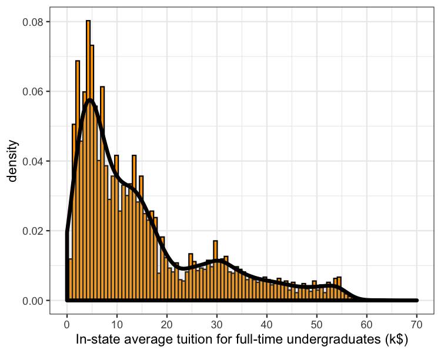

# IPEDS-stats

 Statistics from [IPEDS](https://nces.ed.gov/ipeds/)
 
 
## In-State Tuition

The in-state tuition cost has roughly 4 peaks, one around 6k\$, the second at around 15k\$, then a third one near 30k\$ and a final peak around 50k\$.

